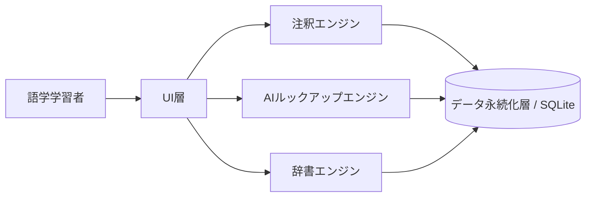
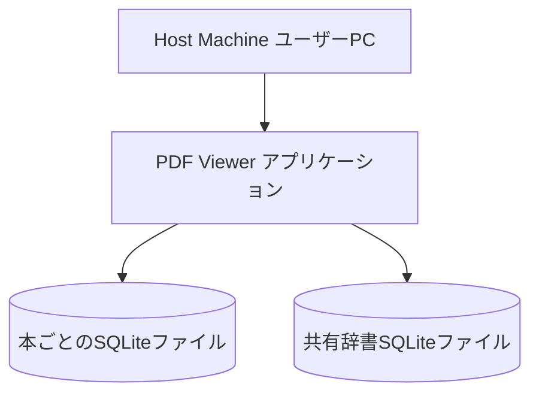
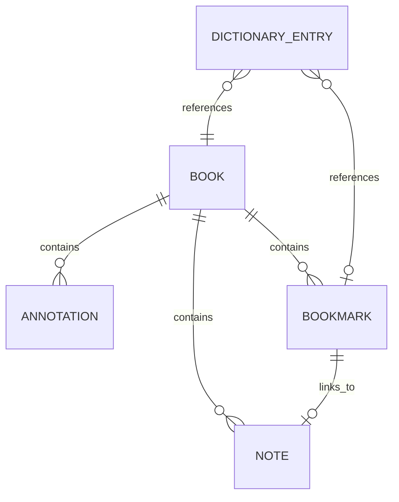

# システム方式設計書

**関連文書**: [要件定義書](../要件定義書.md) / [トレーサビリティ](../トレーサビリティ.md)

---

## 1. 表紙・改訂履歴

| 項目      | 内容              |
| ------- | --------------- |
| プロジェクト名 | PDF Viewer(仮称)  |
| バージョン   | v0.1(ドラフト)      |
| 作成日     | 2026-09-15      |
| 作成者     | 春霞              |

### 改訂履歴

| 改訂日        | バージョン | 変更内容            |
| ---------- | ----- | --------------- |
| 2026-09-15 | v0.1  | 初版作成(ドラフト)。 |

---

## 2. システム全体構成 {: #system-overview }

### 2.1 全体アーキテクチャ

語学学習者が電子書籍(PDF)を読みながら、同一ウィンドウ内で自由に描画・書き込みができ、既知の単語や参照をシームレスにノートへ紐付けられる、没入型の読書・ノートアプリケーションを提供する。



### 2.2 システム境界

本システムはPDF描画・ノート・AIルックアップ・個人辞書機能とそのデータ永続化を担当範囲とする。PC本体・OS・ストレージ等の実行環境、およびAIモデルの訓練自体は範囲外とし、既存オープンモデルの利用に留める(4章参照)。

### 2.3 アーキテクチャ方針

* 各機能(注釈・AIルックアップ・辞書)は共通の基盤モデルを共有し、連携して動作する構成とする(個別機能の寄せ集めにしない)
* サーバープロセスを必要としない組込み型DB(SQLite)を採用し、単一ユーザーのデスクトップ環境に最適化する
* 実装速度よりも正しさを優先する

---

## 3. ハードウェア構成・実行環境 {: #deployment-env }

| 項目       | 内容                       |
| -------- | ------------------------ |
| OS       | 未定(Java実行環境が動作する主要デスクトップOSを想定) |
| CPU      | ユーザー所有PCに依存(本システムでは設計対象外) |
| Memory   | ユーザー所有PCに依存(本システムでは設計対象外) |
| Runtime  | Java(JRE)                |
| Database | SQLite                   |

### 3.1 配置構成



---

## 4. ソフトウェア構成 {: #software-components }

### 4.1 コンポーネント構成

本システムは、以下4つの機能モジュールが**共通の基盤モデルを共有し連携動作**する構成とする(バラバラな機能の寄せ集めにはしない)。

| コンポーネント          | 責務                                     |
| ---------------- | -------------------------------------- |
| UI層              | PDF表示、描画・書き込みインターフェース                    |
| 注釈エンジン          | 描画・書き込み・テキストブックマークの管理、ノートとの紐付け          |
| AIルックアップエンジン   | 単語・専門用語・語源などに範囲を限定した即時AI検索              |
| 辞書エンジン          | 学習者が単語をアーカイブできる個人辞書機能                  |
| データ永続化層         | SQLiteによるデータ管理(ハイブリッド構成、3.3節・5章参照)     |

### 4.2 レイヤー構成

```text
UI層
      ↓
注釈エンジン / AIルックアップエンジン / 辞書エンジン
      ↓
データ永続化層(SQLite)
```

### 4.3 コンポーネント間の関係

UI層はユーザー操作を受け取り、注釈エンジン・AIルックアップエンジン・辞書エンジンへ処理を委譲する。各エンジンは共通の基盤モデルを参照し、本ごとのブックマーク情報を辞書エンジンの参照キーとして共有するなど、相互に連携する。全エンジンはデータ永続化層を介してSQLiteへ読み書きする。

### 4.4 設計原則

* 単一責任: 各エンジンは担当機能(注釈/AI/辞書)のみを担う
* 依存方向: UI層 → 各エンジン → データ永続化層の一方向とする
* エラーハンドリング: N-05(品質方針)に基づき、クラッシュ・データ損失の防止を最優先とする(8章参照)
* ロギング: 次工程で具体化する
* 設定管理: 次工程で具体化する
* 外部依存の隔離: AIモデルへの依存はAIルックアップエンジン内に限定し、他コンポーネントへ波及させない

---

## 5. データ設計 {: #data-design }

### 5.1 データモデル



### 5.2 エンティティ

#### Book(本ごとのSQLiteファイル)

| 属性    | 型      | 必須  | 説明          |
| ----- | ------ | --- | ----------- |
| id    | string | Yes | 本の識別子/ファイルパス |
| title | string | Yes | 本のタイトル      |

#### Annotation

| 属性       | 型      | 必須  | 説明        |
| -------- | ------ | --- | --------- |
| id       | string | Yes | 識別子       |
| book_id  | string | Yes | 対応する本     |
| position | string | Yes | PDF上の描画位置 |
| content  | blob   | Yes | 描画データ     |

#### Note

| 属性          | 型      | 必須  | 説明             |
| ----------- | ------ | --- | -------------- |
| id          | string | Yes | 識別子            |
| book_id     | string | Yes | 対応する本          |
| bookmark_id | string | No  | 対応するブックマーク     |
| body        | text   | Yes | ノート本文(文章形式)    |

#### Bookmark

| 属性            | 型      | 必須  | 説明           |
| ------------- | ------ | --- | ------------ |
| id            | string | Yes | 識別子          |
| book_id       | string | Yes | 対応する本        |
| text_position | string | Yes | PDF内のテキスト位置  |

#### DictionaryEntry(横断共有SQLiteファイル)

| 属性                  | 型      | 必須  | 説明              |
| ------------------- | ------ | --- | --------------- |
| id                  | string | Yes | 識別子             |
| word                | string | Yes | アーカイブされた単語      |
| source_book_id      | string | Yes | 由来となった本への参照     |
| source_bookmark_id  | string | No  | 由来となったブックマークへの参照 |

---

## 6. 外部インターフェース {: #external-interfaces }

### 6.1 API

| API   | Method | 用途                                        |
| ----- | ------ | ----------------------------------------- |
| 該当なし | —      | ローカルデスクトップアプリケーションのため、外部公開APIは設けない |

### 6.2 外部サービス

| サービス          | 用途                     | 認証                          |
| ------------- | ---------------------- | --------------------------- |
| AIルックアップ用モデル | F-04(AIルックアップ)実行時の語彙検索 | 未定(既存オープンモデルとの通信方式は次工程で検討) |

### 6.3 CLI

未定。GUIアプリケーションを主とし、CLIの要否は次工程で検討する。

---

## 7. 非機能要件の反映 {: #nfr-mapping }

| 要件               | 設計上の対応                                              |
| ---------------- | --------------------------------------------------- |
| N-01(プラットフォーム)   | PC専用デスクトップアプリケーションとして設計。モバイル・Web版は非対応(3章)            |
| N-02(オフライン動作)    | AIルックアップエンジンを除く全コンポーネントをオフラインで動作するよう設計                |
| N-03(実装言語)       | 全コンポーネントをJavaで実装                                     |
| N-04(開発体制)       | 単一開発者による構成とし、複雑な分散開発プロセスは前提としない                      |
| N-05(品質方針)       | エラーハンドリング・ロギング方針(8章)により、クラッシュ・データ損失の防止を優先            |
| N-06(データベース)     | 本ごとのSQLiteファイルと横断共有SQLiteファイルのハイブリッド構成により実現(5章)      |

---

## 8. エラーハンドリング・ロギング {: #error-handling }

### 8.1 エラー分類

| 種別      | 例                                  | 処理                                                    |
| ------- | ---------------------------------- | ------------------------------------------------------ |
| 入力エラー   | 非対応PDF(スキャン画像PDF)の読み込み試行           | 電子データPDFではない旨をユーザーに通知し、読み込みを中止                          |
| 外部依存エラー | AIルックアップエンジンの応答不可・オフライン時のAI呼び出し | オフライン時は機能を無効化しユーザーに通知(N-02準拠)                           |
| 内部エラー   | SQLite書き込み失敗等                      | N-05方針に基づき、データ損失防止を最優先としたリトライ・保護処理を行う(詳細は次工程で具体化) |

### 8.2 ロギング方針

未定。ログレベル・出力先・保持期間等は次工程で具体化する。

---

## 9. セキュリティ設計 {: #security }

### 9.1 認証

該当なし。単一ユーザーのローカルデスクトップアプリのため、認証機構は設けない。

### 9.2 認可

該当なし(同上の理由による)。

### 9.3 秘密情報

AIルックアップエンジンが外部モデルと通信する場合の認証情報等の管理方式は次工程で検討する。

---

## 10. 運用・ライフサイクル {: #lifecycle }

### 10.1 起動

未定。次工程で具体化する。

### 10.2 停止

未定。次工程で具体化する。

### 10.3 再起動

未定。次工程で具体化する。

### 10.4 アップグレード

未定。次工程で具体化する。

### 10.5 データ移行

本ごとのSQLiteファイル・共有辞書ファイルのスキーマ変更時の移行方式は次工程で検討する。

---

## 11. 設計上の判断事項 {: #decisions }

| ID      | 判断事項           | 採用案                                             | 理由                                                                                     |
| ------- | -------------- | ------------------------------------------------ | -------------------------------------------------------------------------------------- |
| ADR-001 | データベースの選定      | SQLite採用(本ごとファイル + 横断共有ファイルのハイブリッド構成)              | サーバープロセス不要で個人開発規模に適し、「一つの知識ファイル」思想と本横断辞書を両立できるため                                             |
| ADR-002 | 実装言語の選定        | Java全面採用                                         | JavaがEnterprise用途に限定されないことを実証する目的も兼ねるため                                                  |
| ADR-003 | OCR対応の要否       | 非対応(電子データPDFに限定)                                 | AI-OCRの訓練コストの高さ、言語間の精度不公平(日本語縦書き等)を理由に対応を見送るため                                            |
| ADR-004 | AI機能の実現方式      | 既存オープンモデルのファインチューニング/プロンプト制約                     | ゼロからのモデル訓練は個人開発の範囲を超えるため                                                                |
| ADR-005 | AIルックアップの対象範囲  | 単語・専門用語・語源に限定したテキスト選択トリガー方式                       | NotebookLM的な自由対話型AIとの差別化、および無関係な質問への応答防止のため                                              |
